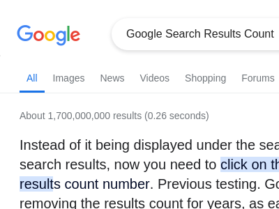

# Google Search Results Count Userscript

This userscript restores the visibility of the search result count on Google Search, which was hidden by Google on May 7, 2024. The script appends the search result count to the top bar where it was previously located.

## Installation

You can install this userscript via [Greasy Fork](https://greasyfork.org/en/scripts/498576-google-search-results-count).

## Screenshot
<!-- Screenshot Before and After -->

<!-- End Screenshot Section -->

## Usage

After installing the script, simply perform a search on Google as usual. The search result count will be displayed at the top of the search results page.

